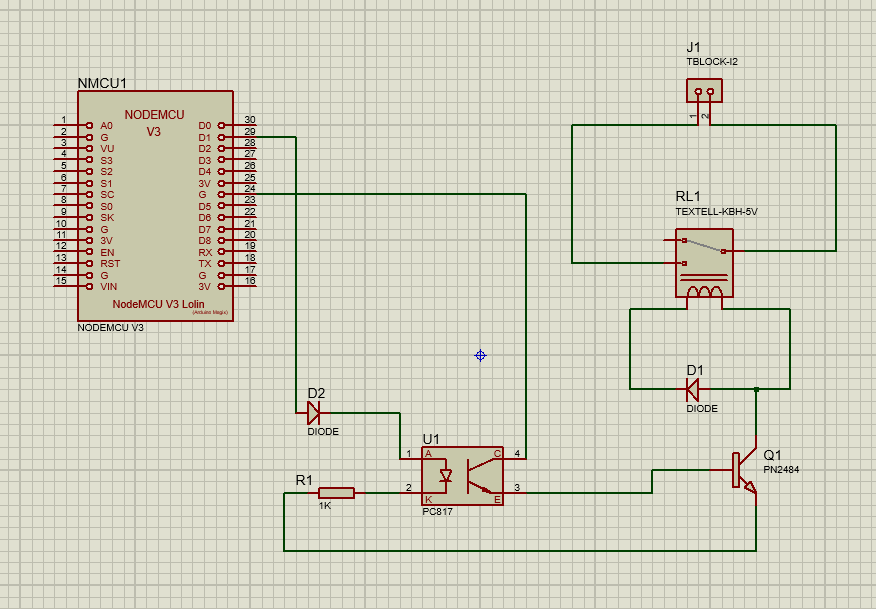

# Introduçao ao PWM

## Funcionamento do projeto
```
Esse projeto faz com que a frequencia do motor mude conforme o botão é pressinado alternando entre os valoes de [0, 63, 127, 192, 255]
```
### Componentes ultilizados
- ARD1
- ARDUINO UNO V2
- R1 
- BUTTON
- MOTOR
- OSCILLOSCOOP
- U1
- L293D

<table align="center">
    <tr>
        <td>
        <a>
            
        </a>
        </td>
    </tr>
    <tr>
        <td>
            <a> 

    #include <Arduino.h>
    const int button = 2;
    int count = 0;
    int lsValores[5] = {0, 63, 127, 192,   255};

    void setup()
    {
        pinMode(button, INPUT);
    }
    void loop()
    {
        if (digitalRead(button))
        {
            count++;
            analogWrite(9, lsValores[count]);
            digitalRead(!button);
            if (count == 6)
            {
                count = 0;
            }
        }
    }
        </a>
        </td>
    </tr>
</table>